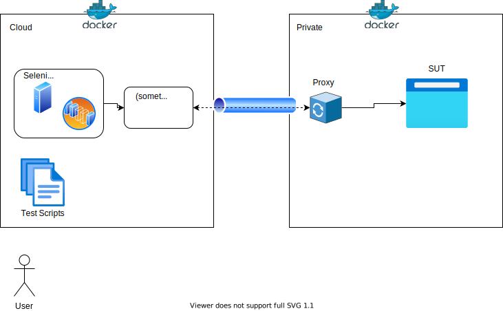

# A tunnel proxy
A tunnel proxy especially for browser testing in private environment from outside



## Set up testing environment

You can set up testing environment by docker-compose.

```
docker-compose up
```

Run webdriverio test by docker container

```
docker-compose run wdio
```