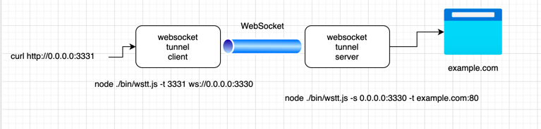

# wstunnel

Establish a TCP socket tunnel over web socket connection.

- <https://www.npmjs.com/package/wstunnel>
- <https://github.com/mhzed/wstunnel>


`wstunnel` defines a customized event "request" between tunnel server and tunnel client. 
When a request is received from client to server, the server further proxies requests to the destination.

https://github.com/hgsgtk/wstunnel/blob/53cc0adac2816105b3ad17ce416ab107d2975b55/lib/ChainedWebApps.js#L31

It's not a production ready especially in terms of error handling.

## Install

```
npm install -g wstunnel
```

or Docker

TBD

### Help

```
$ wstunnel

Run websocket tunnel server or client.
To run server: wstunnel -s 0.0.0.0:8080
To run client: wstunnel -t localport:host:port ws[s]://wshost:wsport
Client via http proxy: wstunnel -t localport:host:port -p http://[user:pass@]host:port ws[s]://wshost:wsport
Client via socks proxy: wstunnel -t localport:host:port -p socks://[user:pass@]ip:port ws[s]://wshost:wsport

Connecting to localhost:localport is the same as connecting to host:port on wshost

For security, you can "lock" the tunnel destination on server side, for eample:
wstunnel -s 0.0.0.0:8080 -t host:port
Server will tunnel incomming websocket connection to host:port only, so client can just run
wstunnel -t localport ws://wshost:port
If client run:
wstunnel -t localport:otherhost:otherport ws://wshost:port
* otherhost:otherport is ignored, tunnel destination is still "host:port" as specified on server.

In client mode, you can bind stdio to the tunnel by running:
wstunnel -t stdio:host:port ws[s]://wshost:wsport
This allows the command to be used as ssh proxy:
ssh -o ProxyCommand="wstunnel -c -t stdio:%h:%p https://wstserver" user@sshdestination
Above command will ssh to "user@sshdestination" via the wstunnel server at "https://wstserver"

Options:
-s             run as server, listen on [localip:]localport                 [string]
--tunnel, -t   run as tunnel client, specify [localip:]localport:host:port
--proxy, -p    connect via a http or socks proxy server in client mode
-c, --anycert  accept any certificates                                      [boolean]  [default: false]
--http         force to use http tunnel                                     [boolean]
```

## Launch

### websocket tunnel server

Run the websocket tunnel server at port 8080 on all interfaces:

```
wstunnel -s 0.0.0.0:3330
```

#### considerations

- lock tunnel destination on the server end

> client picks the final tunnel destination, similar to ssh tunnel. Alternatively for security reason, you can lock tunnel destination on the server end

### websocket tunnel client

```
wstunnel -t 3331 ws://0.0.0.0:3330
```

> In both examples, connection to localhost:33 on client will be tunneled to 2.2.2.2:33 on server via websocket connection in between.

## Try and errors

### Case1: x-websocket-reject-reason: "Unable to determine tunnel target"

- launch websocket tunnel server

```
wstunnel -s 0.0.0.0:3330
```

- launch websocket tunnel client

```
wstunnel -t 3331 ws://0.0.0.0:3330
```

- send http request by curl

```
curl http://0.0.0.0:3331
```

- The websocket tunnel server logged out

```
[Aug 25 2021 05:29:06.997 GMT+0900] WS connect error: Error: Server responded with a non-101 status: 500 Internal Server Error
Response Headers Follow:
connection: close
x-websocket-reject-reason: "Unable to determine tunnel target"

[Aug 25 2021 05:29:07.006 GMT+0900] HTTP connect error: Error: Http conn rejected, status: 500, msg: "Unable to determine tunnel target"
[Aug 25 2021 05:29:07.007 GMT+0900] WS connect error: Error: Http conn rejected, status: 500, msg: "Unable to determine tunnel target"
```

The error `Unable to determine tunnel target` caused when wstunnel server parse a destination url.

https://github.com/hgsgtk/wstunnel/blob/53cc0adac2816105b3ad17ce416ab107d2975b55/lib/WstServer.js#L112

As I explained in case2, we should define both host and port.

### Case2: request passing client -> server



- launch websocket tunnel server

```
node ./bin/wstt.js -s 0.0.0.0:3330 -t example.com:80
```

- launch websocket tunnel client

```
node ./bin/wstt.js -t 3331 ws://0.0.0.0:3330
```

- send http request by curl

```
$ curl http://0.0.0.0:3331

<?xml version="1.0" encoding="iso-8859-1"?>
<!DOCTYPE html PUBLIC "-//W3C//DTD XHTML 1.0 Transitional//EN"
         "http://www.w3.org/TR/xhtml1/DTD/xhtml1-transitional.dtd">
<html xmlns="http://www.w3.org/1999/xhtml" xml:lang="en" lang="en">
	<head>
		<title>404 - Not Found</title>
	</head>
	<body>
		<h1>404 - Not Found</h1>
	</body>
</html>
```
